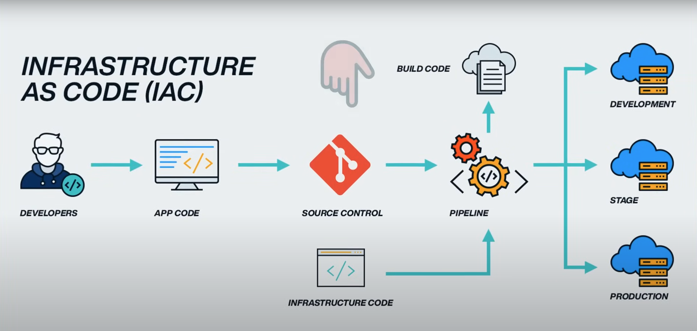
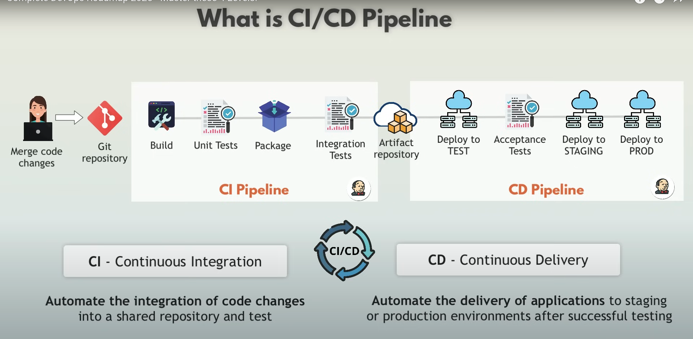
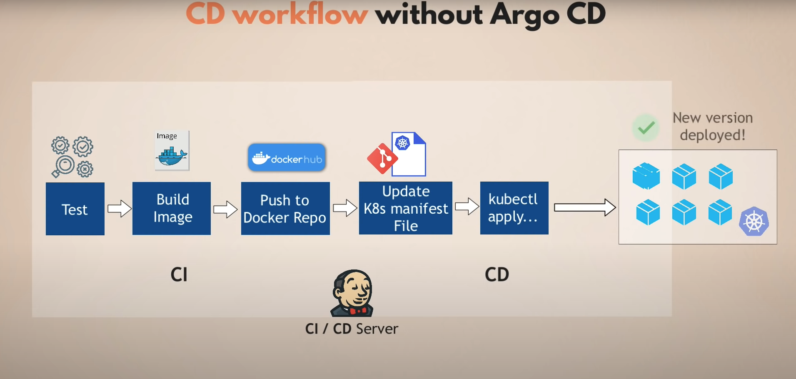
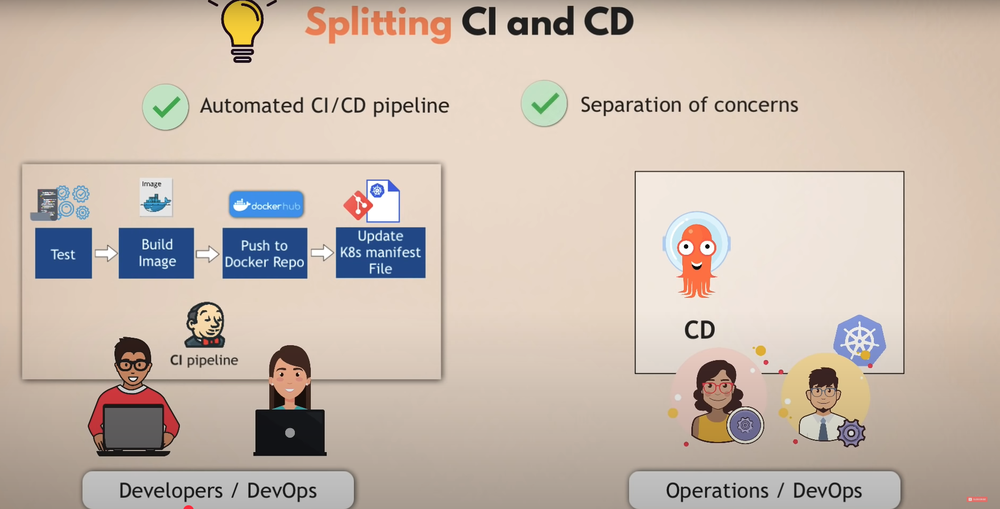
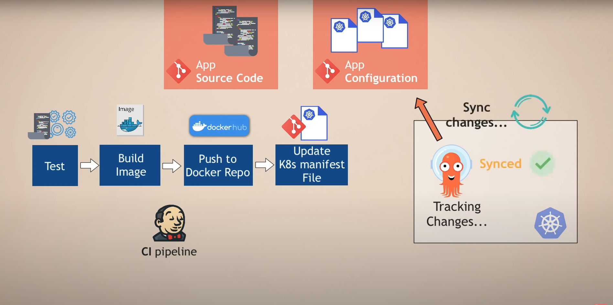
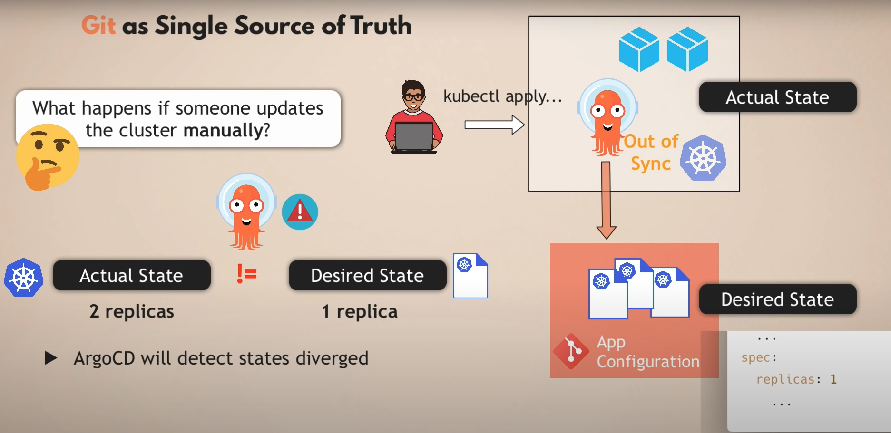
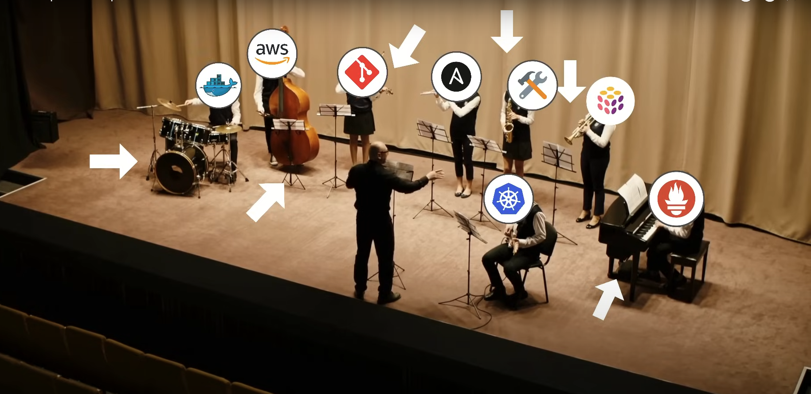
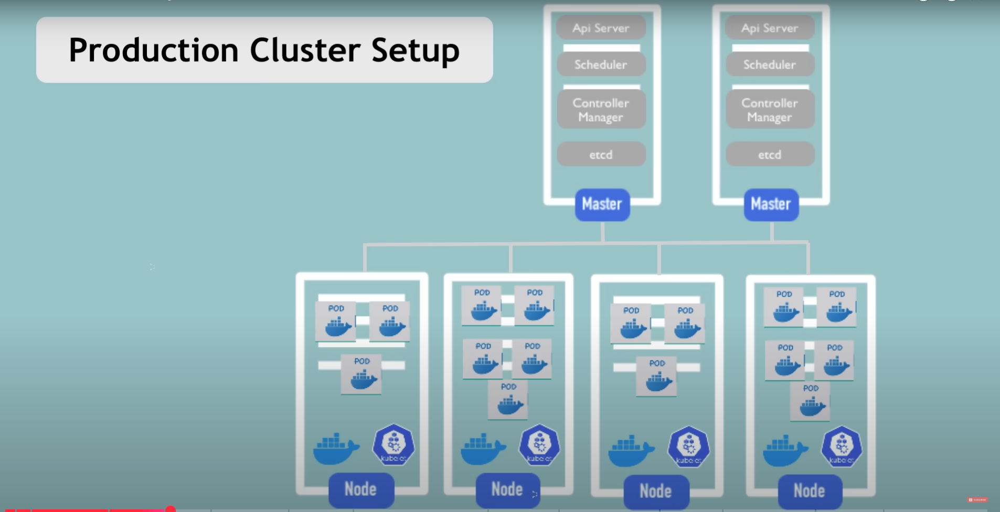
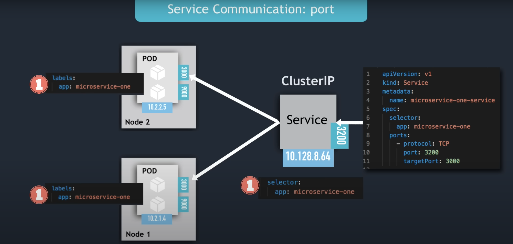

# Inception of Things (IoT) - Road to DevOps

A comprehensive collection of DevOps resources, tools, and architectural examples designed to guide your journey from traditional development practices to modern DevOps methodologies. This repository demonstrates Infrastructure as Code, CI/CD pipelines, Kubernetes orchestration, and GitOps workflows.

## 📋 Table of Contents

- [Project Overview](#project-overview)
- [Technologies Used](#technologies-used)
- [Prerequisites](#prerequisites)
- [Features](#features)
- [Architecture Diagrams](#architecture-diagrams)
  - [Infrastructure as Code](#infrastructure-as-code)
  - [CI/CD Pipelines](#cicd-pipelines)
  - [Kubernetes Architecture](#kubernetes-architecture)
  - [GitOps Workflows](#gitops-workflows)

## 🚀 Project Overview

This project showcases various DevOps patterns and architectures, including:
- Infrastructure provisioning with code
- Continuous Integration and Continuous Deployment pipelines
- Kubernetes cluster management and orchestration
- GitOps workflows with ArgoCD
- Service mesh and microservices architecture
- scripted automation for DevOps tasks
- Monitoring and observability solutions

## 🛠️ Technologies Used

  

- **🐳 Containerization**: Docker
- **⚙️ Orchestration**: Kubernetes, K3s, K3d, kubectl, Helm
- **🔄 CI/CD**: GitLab CI, GitHub Actions
- **🔀 GitOps**: ArgoCD
- **🏗️ Infrastructure as Code**: Ansible
- **☁️ Cloud Platforms**: DigitalOcean, Contabo
- **📦 Package Management**: Helm
- **🛠️ Scripting**: Bash

## 📋 Prerequisites

- Docker installed and running
- Kubernetes cluster (local or cloud-based)
- Git version control
- Basic understanding of containerization and orchestration concepts
- Familiarity with CI/CD concepts

## ✨ Features

- **Infrastructure as Code (IaC)**: Automated infrastructure provisioning and management
- **CI/CD Automation**: Complete pipeline automation from code commit to production deployment
- **Kubernetes Orchestration**: Container orchestration and management at scale
- **GitOps Implementation**: Git-driven operational workflows with ArgoCD
- **Monitoring & Observability**: Integrated monitoring and logging solutions
- **Security Best Practices**: Security scanning and compliance checks

## 🏗️ Architecture Diagrams

### Infrastructure as Code

  

*Automated infrastructure provisioning using Terraform, Ansible, and cloud providers.*

### CI/CD Pipelines

#### Traditional CI/CD Pipeline

  

#### CI/CD Pipeline without ArgoCD

  

#### Split CI/CD Pipeline Architecture

  

#### CI/CD Pipeline with ArgoCD

  

### GitOps Workflows

  

*Git-driven deployment workflows ensuring consistency and auditability.*

### Kubernetes Architecture

#### Kubernetes Orchestration Overview

  

#### Kubernetes Cluster Architecture

  

#### Kubernetes Services

  

---

### 🚀 Made with ❤️ by **afadlane**

*Crafting the future of DevOps, one commit at a time* 🛠️

